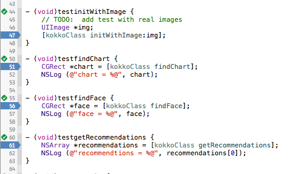
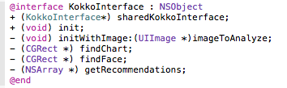
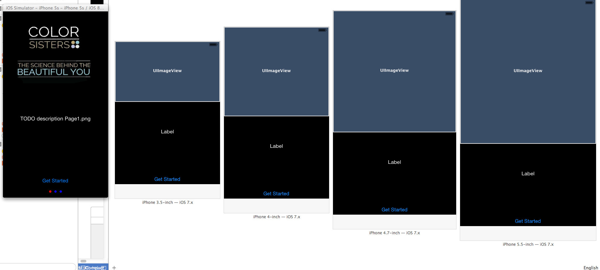
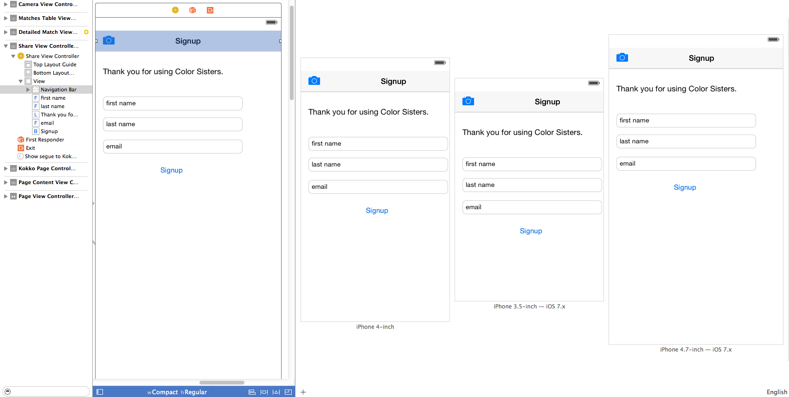
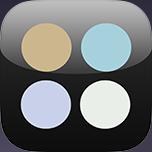
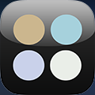
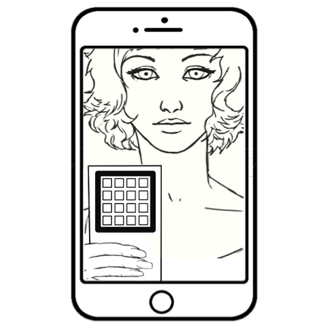

# ColorSisters
##iOS Release notes
Copyright (c) 2014 Kokko, Inc. All rights reserved.


## Toolchain
* Xcode Version 6.1.1 (6A2008a)
* iOS SDK 8.1
* Deployment Target 7.1
* Mavericks, OS X 10.9.5 (13F34)
* [Markdown](http://daringfireball.net/projects/markdown/) for HTML documentation from Readme.md
* Git, https://<user>@kokko.git.cloudforge.com/ioscolorsisters.git
* [Cloud Forge](https://kokko.git.cloudforge.com/ioscolorsisters)


## Tests
KokkoInterfaceTests are filled out and can be an excellent way to test many different types of images.
Builds are tested against

* iPod 5th generation iOS 8.1.1 (12B435)
* iPhone 5c iOS 8.1.1 (12B435)

## Build Notes

### 2 Dec 2014
* Getting Started - set black background for the entire view
* Getting Started - support gestures for horizontal scroll
* Camera View - Once you touch “getting started” it should open the camera view (viewfinder mode), unless the camera is unavailable, in which case open in picker view.
* Camera View - Cancel should take you back to the launch pages
* Camera View - Flash control is disabled (rear camera)
* Known Issues with this build
  * Share Results - Layout and storyboard previews are fine, but device shows an error (under investigation, see Images below)
  * Getting Started - Needs 8 second timer (under investigation)
  * Matches - Layout issues, too high (needs more space below the status bar)
  * TODO:  Since you have the data, could fake up showing a recommendation.

### 27 Nov 2014
* Updated KokkoInterface with: unit tests, exception handling, NSArray returns, and proper signatures based on feedback



### 26 Nov 2014
* Moved KokkoInterface out of AppDelegate to [KokkoInterface init]



### 25 Nov 2014
* Version 1.5, Build 5
* Camera tested on iPod 5th & iPhone 5c (iOS 8.1.1 (12B435))
* KokkoInterface called in separate threads, called at didFinishLaunch() and after didFinishPickingMedia()
  * Test results to show singleton, memory pointer values are identical

```
ColorSisters[4970:3070480] KokkoInterface async via Grand Central Dispatch

ColorSisters[4970:3070480] KokkoInterface init in didFinish() = 0x7fb2c0452420

ColorSisters[4970:3070447] KokkoInterface init in didFinishPickingMedia() = 0x7fb2c0452420
```

### 24 Nov 2014
* Version 1.4, Build 4
* Added interface class, as a singleton, to didFinishLaunchingWithOptions
* Initial version of UIPageControl for "home" or launch page
* Added Image assets from Kokko, Inc (FFAppImages.zip)
* Updated projects LaunchScreen.xib.  (This is different from the spec's launch page).
* Fixed many layout issues due to Storyboards.  Still TODO

### 20 Nov 2014
* Version 1.3, Build 3
* Turn off flash with .showsCameraControls = NO
* Added KokkoGetProductImages() with methods from email (Scott, 20 Nov 2014)


### 20 Nov 2014
* Version 1.2, Build 2
* Same known issues as Build 1
* Changed extension to UIImage+Match.mm
* Deployment target 7.1


### 18 Nov 2014
* Bundle Identifier - com.kokko.ColorSisters
* Version 1.0, Build 1


### Fixed Issues
* Storyboards are universal, and is messing up layouts on iPod Touch & iPhone 5c devices and simulators
* First revision of Interface, See Interface/UIImage+Match.m
  * Interface is built as UIImage "category", which is basically an extension of UIImage
  * See UIImage+Match.h
  * findChart() and findFace() are methods, but in another iteration they should be propertys?!?


# Images

# Screen Shots and Previews
## GettingStarted-preview.png

***

## ShareResults-preview.png

***

## Icon
### Icon-60


### Icon-76




### Icon-Small


### Icon-Small-40





## Getting Started
### Page1.png


### Page2.png


### Page3.png



## LaunchScreen.xib
### CS_ios640x920.png


### CS_ios640x960.png


### CS_ios640x1136.png

